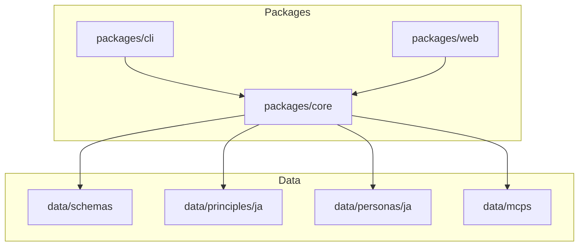

# kaiden 開発進捗レポート

**レポート生成日時**: 2026-01-28  
**プロジェクトバージョン**: 0.1.0

---

## 📊 全体進捗サマリー

| フェーズ | ステータス | 進捗率 |
|---------|----------|--------|
| Phase 1: 基盤 | ✅ 完了 | 100% |
| Phase 2: Web UI | ✅ 完了 | 100% |
| Phase 3: 拡張 | ⏳ 未着手 | 0% |

---

## Phase 1: 基盤（✅ 完了）

### 1. JSON Schema 定義 ✅

`data/schemas/` に以下のスキーマが定義済み：

| スキーマ | ファイル | 機能 |
|---------|---------|------|
| 原則 | [`principle.schema.json`](../data/schemas/principle.schema.json) | 設計原則のデータ構造を定義 |
| ペルソナ | [`persona.schema.json`](../data/schemas/persona.schema.json) | ペルソナのデータ構造を定義 |
| MCP | [`mcp.schema.json`](../data/schemas/mcp.schema.json) | MCPサーバー情報の構造を定義 |

**特徴**:
- JSON Schema Draft 2020-12 準拠
- 緊張関係（tensions）、子原則（children）、推奨ペルソナなどを含む豊富なメタデータ

---

### 2. サンプルデータ作成 ✅

#### 原則データ（`data/principles/ja/`）

| 原則 | ファイル | 説明 |
|-----|---------|------|
| SOLID | [`solid.yaml`](../data/principles/ja/solid.yaml) | オブジェクト指向5原則（SRP, OCP, LSP, ISP, DIP） |
| DRY | [`dry.yaml`](../data/principles/ja/dry.yaml) | Dont Repeat Yourself |
| YAGNI | [`yagni.yaml`](../data/principles/ja/yagni.yaml) | You Arent Gonna Need It |
| KISS | [`kiss.yaml`](../data/principles/ja/kiss.yaml) | Keep It Simple Stupid |

**実装済み機能**:
- ✅ 親子関係（SOLID → SRP, OCP, LSP, ISP, DIP）
- ✅ 緊張関係（SOLID ↔ YAGNI, KISS）
- ✅ ペルソナ別推奨度（weight）
- ✅ 参考文献リンク

#### ペルソナデータ（`data/personas/ja/`）

| ペルソナ | ファイル | アイコン | 説明 |
|---------|---------|---------|------|
| スピードコーダー | [`speed-coder.yaml`](../data/personas/ja/speed-coder.yaml) | ⚡ | MVP・プロトタイプ向け |
| コンサルタント | [`consultant.yaml`](../data/personas/ja/consultant.yaml) | 💼 | バランス重視 |
| コードレビュアー | [`auditor.yaml`](../data/personas/ja/auditor.yaml) | 🔍 | 品質・セキュリティ重視 |

**実装済み機能**:
- ✅ デフォルト原則設定（enabled, weight）
- ✅ スタイル設定（verbosity, tone, focusAreas）
- ✅ 依存バージョン範囲（semver）

#### MCPデータ（`data/mcps/`）

| MCP | ファイル | 説明 |
|-----|---------|------|
| Filesystem | [`filesystem.yaml`](../data/mcps/filesystem.yaml) | ローカルファイルシステムアクセス |

**実装済み機能**:
- ✅ 設定テンプレート
- ✅ 環境変数定義
- ✅ ツール一覧

---

### 3. core パッケージ - 生成ロジック ✅

`packages/core/` に以下のモジュールが実装済み：

```
packages/core/src/
├── types/          # 型定義
│   ├── common.ts   # Result型、共通型
│   ├── principle.ts
│   ├── persona.ts
│   └── mcp.ts
├── validators/     # スキーマ検証
│   ├── schema-loader.ts
│   ├── schema-validator.ts
│   ├── data-loader.ts
│   └── data-validator.ts
├── resolvers/      # 依存解決
│   ├── principle-resolver.ts  # 原則の解決・バージョン管理
│   └── persona-resolver.ts    # ペルソナの解決
└── generators/     # AGENTS.md生成
    ├── agents-generator.ts    # メインジェネレーター
    ├── section-builder.ts     # セクション構築
    └── template-engine.ts     # テンプレート処理
```

**設計パターン**:
- ✅ SOLID準拠（SRP, DIP）
- ✅ Result型によるエラーハンドリング
- ✅ インターフェースベースの設計

---

### 4. CLI - generate コマンド ✅

`packages/cli/` に以下のコマンドが実装済み：

| コマンド | 説明 | 使用例 |
|---------|------|--------|
| `validate` | データファイルのスキーマ検証 | `kaiden validate -t principles` |
| `generate` | AGENTS.md生成 | `kaiden generate -p auditor -o ./AGENTS.md` |
| `list` | ペルソナ/原則の一覧表示 | `kaiden list personas` |

**CLIオプション**:

```bash
# 検証
kaiden validate              # 全データを検証
kaiden validate -t principles  # 原則のみ
kaiden validate -t personas    # ペルソナのみ
kaiden validate -t mcps        # MCPのみ

# 生成
kaiden generate -p <persona>   # ペルソナ指定（必須）
kaiden generate -o <path>      # 出力先（デフォルト: ./AGENTS.generated.md）
kaiden generate -n <name>      # プロジェクト名

# 一覧
kaiden list personas
kaiden list principles
```

---

## Phase 2: Web UI（✅ 完了）

### 5. Astro プロジェクトセットアップ ✅

`packages/web/` に Astro + Svelte プロジェクトを作成：

```
packages/web/
├── astro.config.mjs          # Astro設定（GitHub Pages対応）
├── package.json
├── tsconfig.json
├── public/
│   └── favicon.svg           # サイトアイコン
└── src/
    ├── layouts/
    │   └── Layout.astro      # 共通レイアウト
    ├── pages/
    │   ├── index.astro       # ホームページ
    │   └── generator.astro   # ジェネレーターページ
    ├── components/
    │   ├── Generator.svelte         # メインジェネレーター
    │   ├── PersonaSelector.svelte   # ペルソナ選択
    │   ├── PrincipleToggle.svelte   # 原則トグル
    │   └── Preview.svelte           # プレビュー
    ├── stores/
    │   └── generator.ts      # 状態管理
    └── lib/
        └── data-loader.ts    # データ読み込み
```

### 6. トグルUI ✅

**実装済みコンポーネント**:

| コンポーネント | 機能 |
|---------------|------|
| [`PersonaSelector.svelte`](../packages/web/src/components/PersonaSelector.svelte) | ペルソナをカード形式で選択 |
| [`PrincipleToggle.svelte`](../packages/web/src/components/PrincipleToggle.svelte) | 原則の有効化/無効化、重要度スライダー |

**UI機能**:
- ✅ ペルソナ選択時に対応する原則が自動でプリセット
- ✅ 原則ごとの有効/無効トグル
- ✅ 重要度（weight）スライダー（0-100%）
- ✅ 子原則の表示
- ✅ 緊張関係の警告表示

### 7. プレビュー・エクスポート ✅

**実装済み機能**:
- ✅ リアルタイムプレビュー（設定変更時に自動更新）
- ✅ クリップボードへコピー
- ✅ ファイルとしてダウンロード（AGENTS.md）

### 8. GitHub Pages デプロイ ✅

`.github/workflows/` に以下のワークフローを設定：

| ワークフロー | ファイル | 機能 |
|-------------|---------|------|
| デプロイ | [`deploy.yml`](../.github/workflows/deploy.yml) | main pushで自動デプロイ |
| 検証 | [`validate.yml`](../.github/workflows/validate.yml) | データ変更時にスキーマ検証 |

**デプロイ設定**:
- サイトURL: `https://kuronekocode.github.io/kaiden/`
- ベースパス: `/kaiden`
- 自動ビルド＆デプロイ

---

## Phase 3: 拡張（⏳ 未着手）

| No. | タスク | 詳細 |
|-----|-------|------|
| 9 | MCP統合 | CLI経由でのMCPセットアップ |
| 10 | お気に入り保存 | localStorage → IndexedDB |
| 11 | PWA化 | オフライン対応 |

---

## 🏗️ プロジェクト構造



---

## 🚀 使い方

### 開発サーバー起動

```bash
# 依存関係インストール
pnpm install

# core パッケージビルド
pnpm --filter @kaiden/core build

# Web UI 開発サーバー
pnpm --filter @kaiden/web dev
```

### ビルド

```bash
# 全パッケージビルド
pnpm build

# Web のみ
pnpm --filter @kaiden/web build
```

### CLI 使用

```bash
# ペルソナ一覧
pnpm --filter @kaiden/cli dev -- list personas

# AGENTS.md 生成
pnpm --filter @kaiden/cli dev -- generate -p auditor
```

---

## 📝 次のステップ推奨

1. **Phase 3の開始**
   - [ ] MCP統合（CLI経由インストール）
   - [ ] お気に入り保存機能
   - [ ] PWA化

2. **データ拡充**
   - [ ] 英語版データの追加（`data/principles/en/`, `data/personas/en/`）
   - [ ] MCPデータの追加（github, slack, notion 等）

3. **テスト整備**
   - [ ] core パッケージのユニットテスト追加
   - [ ] E2Eテスト（生成結果の検証）

4. **ドキュメント**
   - [ ] CONTRIBUTING.md の作成
   - [ ] APIドキュメントの整備

---

## 📁 ファイル詳細

### 実装済みファイル一覧

```
kaiden/
├── packages/
│   ├── core/                     # ✅ 実装済み
│   │   ├── src/
│   │   │   ├── types/           # ✅ 型定義
│   │   │   ├── validators/      # ✅ スキーマ検証
│   │   │   ├── resolvers/       # ✅ 依存解決
│   │   │   └── generators/      # ✅ AGENTS.md生成
│   │   └── package.json
│   │
│   ├── cli/                      # ✅ 実装済み
│   │   ├── src/
│   │   │   ├── index.ts         # ✅ エントリポイント
│   │   │   └── commands/        # ✅ validate, generate, list
│   │   └── package.json
│   │
│   └── web/                      # ✅ 実装済み
│       ├── src/
│       │   ├── layouts/         # ✅ 共通レイアウト
│       │   ├── pages/           # ✅ ホーム、ジェネレーター
│       │   ├── components/      # ✅ Svelteコンポーネント
│       │   ├── stores/          # ✅ 状態管理
│       │   └── lib/             # ✅ データローダー
│       └── package.json
│
├── data/
│   ├── schemas/                  # ✅ 実装済み
│   │   ├── principle.schema.json
│   │   ├── persona.schema.json
│   │   └── mcp.schema.json
│   │
│   ├── principles/ja/            # ✅ 実装済み
│   │   ├── solid.yaml
│   │   ├── dry.yaml
│   │   ├── yagni.yaml
│   │   └── kiss.yaml
│   │
│   ├── personas/ja/              # ✅ 実装済み
│   │   ├── speed-coder.yaml
│   │   ├── consultant.yaml
│   │   └── auditor.yaml
│   │
│   └── mcps/                     # ✅ 実装済み（1件）
│       └── filesystem.yaml
│
├── .github/workflows/            # ✅ 実装済み
│   ├── deploy.yml               # GitHub Pages デプロイ
│   └── validate.yml             # スキーマ検証
│
├── docs/                         # ✅ 実装済み
│   ├── DESIGN.md
│   └── SCHEMA.md
│
├── AGENTS.md                     # ✅ プロジェクト設定
├── LICENSE                       # ✅ MIT
├── README.md                     # ⚠️ 最小限
└── package.json                  # ✅ ワークスペース設定
```
